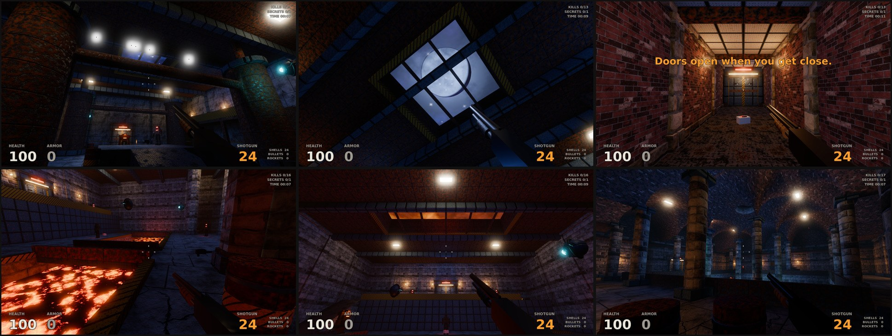

# Brushfire

> **Undercity is next.** Brushfire is becoming the tech base for *Undercity*, an immersive sim
> set in the underbelly of a cyberpunk city. It is designed, not built yet:
> - the requirements are in [`openspec/changes/`](openspec/changes/);
> - the design page is [`docs/design/`](docs/design/), with Deus Ex-style maps generated from
>   [`tools/levels/layouts/`](tools/levels/layouts/);
> - the rules for working in this repository are in [CLAUDE.md](CLAUDE.md).
>
> The three levels below stay as reference maps.

An old-school first-person shooter in **Godot 4.7 (.NET / C#)**, built the way Quake 2 and
Unreal-era levels were: brushes, a "compile" step, and fully baked lighting. It has three
levels, each built in a different tool:

| Level | Tool | Source you edit | What Godot loads |
|---|---|---|---|
| E1M1: Pump Station | **Godot CSG** | `CSGSource` brushes in `game/levels/csg/level_csg.tscn` | baked mesh `level_csg_geometry.res` |
| E1M2: Slag Works | **TrenchBroom** | `game/levels/trenchbroom/slag_works.map` | built by **func_godot** |
| E1M3: The Cistern | **Blender** (boolean/CSG cutters) | `tools/blender/cistern.blend` | `game/levels/blender/cistern.glb` |

All level materials are **PBR materials made in Material Maker**: albedo, normal map, and ORM
(occlusion/roughness/metallic). All lighting is **baked with LightmapGI**: directional
lightmaps plus light probes, with reflection probes for specular.



## Running it

1. Install **Godot 4.7 .NET** (tested with 4.7.2) and the **.NET 8 SDK**.
2. Open `game/project.godot`. Godot imports assets and builds the C# project on first open.
3. Press F5 and pick a level from the menu.

The shipped levels are already compiled and baked, so you don't need TrenchBroom, Blender or
Material Maker just to play.

### Controls

| | |
|---|---|
| WASD / arrows | move |
| Mouse | look |
| Space | jump (hold for bunny hop) |
| Ctrl / C | crouch (crouch-jump tucks your legs) |
| Shift | sprint |
| LMB | fire |
| 1-3, mouse wheel | weapons |
| F | flashlight |
| Esc | pause / options |
| F11 | fullscreen |

Gamepads work too: left stick moves, right stick looks, RT fires, A jumps, B crouches.

## Gameplay

* **Controller** (`scripts/Player/PlayerController.cs`):
  * Movement follows the Quake model: ground acceleration and friction, capped air acceleration (strafe-jumping and bunny-hopping work).
  * Coyote time and jump buffering.
  * Stair stepping up and down, with camera smoothing.
  * Crouch with a headroom check, plus crouch-jumping.
  * Runs at a fixed physics tick with physics interpolation. The camera updates every rendered frame and mouse look applies immediately.
  * Head bob with footsteps synced to it, strafe tilt, landing dip, sprint FOV, recoil and trauma screen shake.
  * FOV is set as horizontal degrees at 16:9.
* **Weapons:**
  * Pump shotgun: sunflower pellet pattern and a pump animation.
  * Chaingun: spins up, spread blooms under sustained fire, tracers.
  * Rocket launcher: rockets converge on the crosshair, splash damage, rocket jumping.
  * The viewmodel draws at 1/4 scale close to the eye, so it never clips into walls.
* **Enemies** (`scripts/Enemies/Enemy.cs`):
  * Grunts fire telegraphed hitscan bursts.
  * Brutes are melee chargers.
  * Drones hover and fire plasma.
  * All of them spot you by sight cone and line of sight, hear gunfire, path on the navmesh, flinch when hurt, and break into physics gibs when killed.
* **World:**
  * Split sliding doors with red/green status lights.
  * Explosive barrels that chain-react.
  * Lava, jump pads, secrets, messages and an exit pad.
  * Pickups: health, megahealth, armour, ammo and weapons.
  * The HUD has a dynamic crosshair, hit markers, a damage direction indicator and level stats.
  * There's an intermission tally screen at the end of each level.
* **Sound:** 60+ effects, a dark ambience bed and a music loop. All are synthesised from scratch by `tools/sfx/generate_sfx.py`. There are reverb buses for the world and weapons.

## The three pipelines

### 1. Godot CSG ("compile the map")

`level_csg.tscn` contains a hidden `CSGSource` node. It starts as a solid block with rooms subtracted
from it, Unreal 1 style, plus additive pillars, stairs and catwalks. Each brush carries its own
material.

To edit it:
1. Show `CSGSource` and hide `Navigation/Geometry`.
2. Move or resize brushes.
3. Run **Project > Tools > Brushfire: Full Rebuild**.

The CSG bake (`addons/brushfire_tools/bake_csg.gd`):
* merges the brushes into one mesh;
* projects world-aligned UVs at the texel density in `materials/materials.json`;
* generates tangents and a lightmap UV2 unwrap;
* culls the outside of the rock and builds a trimesh collider.

The full rebuild then bakes the navmesh and the lightmaps. At runtime the CSG nodes are freed
before they compute anything.

`tools/godot/gen_level_csg.py` generated the starting layout. Re-running it overwrites your edits.

### 2. TrenchBroom + func_godot

`slag_works.map` is a normal Valve-220 TrenchBroom map, with sealed brushwork, angled brushes,
entities and triggers.

**Set up TrenchBroom:** copy `tools/trenchbroom/Brushfire` into TrenchBroom's `games` folder,
then set the game path to the `game/` folder. Alternatively, select
`levels/trenchbroom/brushfire_tb_config.tres` in Godot and press *Export GameConfig*. Textures
come straight from `game/textures`, the same images the materials use, so texel density
matches in every tool.

**Entities:**

| Kind | Entities |
|---|---|
| Point | `info_player_start`, `monster_grunt` / `monster_brute` / `monster_drone`, `item_*`, `weapon_*`, `misc_explobox`, `misc_doorway`, `misc_archway_*`, `light_fixture`, `light_wall`, `light` (Quake keys `light`, `_color`) |
| Brush | `func_door`, `func_detail`, `func_illusionary` (the secret wall), `trigger_hurt`, `trigger_push`, `trigger_secret`, `trigger_message`, `trigger_exit` |
| Tool textures | `skip`, `clip`, `trigger` |

**Rebuild after editing:** select the `Map` node and press **Build Map**, or run
**Brushfire: Full Rebuild**. The build unwraps UV2 for lightmapping and saves the brush meshes
as `.res` files.

`tools/trenchbroom/gen_map.py` generated the initial map. It turns room volumes into sealed
Quake brushes and textures buried faces with `skip`.

### 3. Blender with boolean cutters

`tools/blender/cistern.blend` is built around one `Shell` object with a Boolean modifier that
subtracts the `Carve` collection (Exact solver, material mode Transfer):
* Box cutters carve rooms. Each cutter's bottom face becomes the floor, its sides the walls and its top the ceiling.
* Cylinder cutters carve the barrel vaults, groin vaults and arches.
* The `Detail` collection holds columns, stairs, railings, pipes and voussoir arch rings.
* A Geometry Nodes `WorldUV` modifier previews the same world-aligned UVs the game uses.
* The `Entities` collection holds empties named `ENT_<kind>_<n>`. Godot's import script (`addons/brushfire_tools/blender_level_import.gd`) replaces them with the game's scenes, and custom properties such as `energy`, `range` and `color` become baked lights or trigger volumes.

To export after editing:

```
blender tools/blender/cistern.blend -b -P tools/blender/export_level.py -- game/levels/blender/cistern.glb
```

The export applies the booleans to a copy, culls the outside, projects UVs and writes a single
`Level-col` mesh, which Godot turns into a trimesh collider. The import preset maps every glTF
material onto `res://materials/*.tres` and generates UV2 for static lightmaps. Then run
**Brushfire: Full Rebuild** in Godot.

`tools/blender/build_cistern.py` rebuilds the `.blend` from scratch. `tools/blender/build_props.py`
builds the doorway kit.

### Doorway kit (Quake 2 / Unreal 1 style)

Modelled in Blender with bevelled edges, in `tools/blender/props.blend` and `game/models/doorway/`:
* **Door frame:** jambs with hazard-lined leaf slots, pilasters with plinths and capitals, hydraulic pistons, corner gussets, a heavy lintel with a sign plate, a status light bar and downlight strips, and a threshold plate with a door track.
* **Leaves:** split sliding leaves with raised panels, ribs and a vision slit.
* **Archway frames:** stone jambs, keystone and cornice, for open passages.

`scenes/props/doorway.tscn` puts it together: a static lightmapped frame, two probe-lit door
leaves, baked downlights and UT99-style glow coronas.

Frame sizes live in `detailing.FRAMES`. Each frame goes in a level opening of its `fits` size, and
its own clear opening is 0.1 m smaller, so its reveals stand proud of the walls and ceiling.

### No z-fighting

Every level generator runs `detailing.assert_no_zfighting()` and refuses to write a level that
fails it. The check finds pairs of faces that share a plane, face the same way and overlap.
It compares the room shells, trims and detail brushes, and the frame props against all of them
and against each other. Trim corners, girder sizes, plinth heights, bridge decks and door
openings are all laid out so the check passes. See `CLAUDE.md` for the rules.

## Art direction: Quake 2 / Unreal 1 era

[`docs/ut99_reference.md`](docs/ut99_reference.md) is the reference set: about 95 of the most-cited
UT99 maps (the official Epic maps plus the community classics from the ut99.org "best of" threads,
the NaliCity hotlist and CliffyB's picks). It also has a style guide distilled from them, with a
15-point "reads as UT99" checklist, and a table of where each rule is implemented. The main pieces:

* **Automatic trims** (`tools/godot/detailing.py`), shared by all three toolchains. It generates baseboards, cornices, hazard bands, pilasters with plinths and capitals, and ceiling girders lined up with the pilasters, working around doors, arches and light fixtures.
* **Sky surfaces**, as in Quake and Unreal. A face with a `sky_*` material becomes a window onto two scrolling cloud layers and a moon (`shaders/sky_surface.gdshader`). Each level has one: a grated skylight, a smoke vent, and an oculus.
* **Zone ambient.** Soft blue per-room fill lights, baked, so shadows go dark blue instead of black.
* **Panning textures**: lava scrolls and pulses (`scripts/World/SurfaceAnimator.cs`).

## Materials (Material Maker to PBR)

`tools/material_maker/ptex/*.ptex` are Material Maker 1.7 graphs:
* 8 custom graphs authored by `build_ptex.py`: tech panels, concrete, ceiling and floor tiles, crate, hazard stripes, light panel and rusted metal.
* 4 of Material Maker's example graphs (bricks, stone wall, diamond plate, lava). These have small PBR fixes, because a few examples left metallic/roughness unwired.

**Pipeline:**
1. Open and tweak the graphs in Material Maker.
2. Run the exporter:
   ```
   MATERIAL_MAKER_DIR=/path/to/material-maker tools/material_maker/export_materials.sh
   ```
3. The exporter drives Material Maker's command-line export and then post-processes:
   * a 2048 px render, Lanczos-downsampled to 1024 px;
   * renormalised OpenGL-convention normal maps (what Godot expects);
   * ORM packing;
   * VRAM-compression import presets, with normal maps compressed as normal maps;
   * `game/materials/<name>.tres` written as `ORMMaterial3D` (metallic/roughness scalars at 1 so the ORM texture drives them, anisotropic filtering, normal scale and emission from `materials.json`).

`materials.json` also sets each material's real-world tile size. The CSG bake, the TrenchBroom
map, the Blender UV projection and the doorway kit all read it.

## Lighting

* Level lights use bake mode **Static**. Their direct and indirect light is baked, and nothing is computed at runtime.
* **LightmapGI** uses directional lightmaps, so normal maps still respond to baked light; 3 bounces; denoiser; and automatic probes plus hand-placed `LightmapProbe` nodes where enemies, pickups and the viewmodel go. Those dynamic objects are lit by the probes.
* Emissive surfaces (light panels, lava, door downlights) contribute to the bake.
* Box-projected **ReflectionProbes** update once per room so metals and wet stone reflect the baked lighting.
* The environment uses AgX tonemapping, SSAO, subtle glow and depth fog. There are warm lamps against cool blue fills in the big halls, plus coronas on fixtures.
* **Zone ambient** (`level_common.add_zone_ambient`): every room gets low, flat-falloff blue fill lights, UT99's per-zone ambient. They are baked with everything else, so shadows are dark blue, never black.
* **Sky surfaces** are unshaded, so they stay bright. A baked spotlight shines in from the direction of each sky's moon.
* **To re-bake**, select the `LightmapGI` node and press *Bake Lightmaps*, or run **Brushfire: Bake Lightmaps**.

## Rebuilding everything from scripts

```
python3 tools/material_maker/build_ptex.py        # Material Maker graphs
tools/material_maker/export_materials.sh          # -> textures + materials (needs Material Maker)
python3 tools/sfx/generate_sfx.py                 # sound effects
python3 tools/fx/generate_fx_textures.py          # particle/decal textures
python3 tools/fx/generate_skies.py                # tileable sky layers for the sky surfaces
python3 tools/godot/gen_scenes.py                 # weapons, enemies, pickups, props
blender -b -P tools/blender/build_props.py        # doorway kit
blender -b -P tools/blender/build_cistern.py      # Blender level
python3 tools/godot/import_presets.py             # glTF import presets
python3 tools/godot/gen_level_csg.py              # CSG level layout
python3 tools/trenchbroom/func_godot_setup.py     # FGD + map settings + TB game config
python3 tools/trenchbroom/gen_map.py && python3 tools/trenchbroom/gen_level_scene.py
python3 tools/godot/gen_level_blender.py
# compile + bake (headless-friendly; uses the editor, so needs a display or Xvfb + Vulkan):
BRUSHFIRE_BATCH="res://levels/csg/level_csg.tscn:csg,nav,lightmap;res://levels/trenchbroom/level_trenchbroom.tscn:map,nav,lightmap;res://levels/blender/level_blender.tscn:nav,lightmap" \
  godot --editor --path game
```

### Undercity's NPC bodies

Every NPC body is generated from `tools/blender/npcs.json` (openspec/changes/archive/2026-09-28-npc-characters).
The packs it draws on stay outside the repository, pinned by SHA-256 in
`tools/deps/character_packs.json`. MPFB2 and the CC0 assets download; the pinned UAL build is no
longer offered (its page now serves a newer, different file), so copy a verified
`ual_standard.zip` into `~/.cache/undercity/deps/packs/` once. The fetch checks it like the others.

```
python3 tools/deps/fetch_character_tools.py                         # MPFB2, the CC0 assets, UAL
blender -b --factory-startup --python tools/blender/build_npcs.py    # -> game/models/characters/*.glb
blender -b --factory-startup --python tools/blender/build_npcs.py -- --verify  # rebuild matches, byte for byte
blender -b --factory-startup --python tools/blender/build_npc_clips.py  # -> game/animations/undercity_clips.glb
godot --headless --path game --import
godot --headless --path game -s res://../tools/godot/setup_npc_import.gd  # bone maps, retarget options
godot --headless --path game --import
godot --headless --path game -s res://../tools/godot/gen_npc_scenes.gd    # -> game/scenes/undercity/npcs/*.tscn
godot --headless --path game res://scenes/undercity/tests/ragdoll_test.tscn  # the ragdoll check
```

`BRUSHFIRE_AUTOTEST=script.json godot --path game` runs a scripted playtest and screenshot
pass (`scripts/Core/AutoTest.cs`). `{"debug_draw": 1}` switches to unshaded, which is handy for
checking generated geometry before spending time on a bake.

## Layout

```
game/                     Godot project (C#)
  scripts/                Core, Player, Enemies, World, UI
  scenes/                 player, weapons, enemies, pickups, props, ui
  levels/csg|trenchbroom|blender
  materials/ textures/    Material Maker PBR output (+ materials.json), sky layers
  shaders/                sky surface shader
  models/doorway/         Blender doorway kit
  audio/sfx/              synthesised sounds
  addons/func_godot/      func_godot 2025.12 (MIT)
  addons/brushfire_tools/ level pipeline editor plugin, import scripts
tools/                    generators: material_maker, blender, trenchbroom, godot, sfx, fx
docs/                     UT99 reference set and style guide, screenshots
```

## Credits

* [func_godot](https://github.com/func-godot/func_godot_plugin) (MIT) imports the TrenchBroom map.
* [Material Maker](https://github.com/RodZill4/material-maker) (MIT): brick, stone wall, diamond plate and lava are based on its example graphs.
* [MPFB2](https://github.com/makehumancommunity/mpfb2) (code GPLv3, not shipped) generates Undercity's NPC bodies from the [MakeHuman system assets](https://files2.makehumancommunity.org/asset_packs/makehuman_system_assets/makehuman_system_assets_cc0.zip) (CC0).
* The [Universal Animation Library](https://quaternius.com/packs/universalanimationlibrary.html) by Quaternius (CC0) animates them (`game/animations/ual/`).
* Everything else (code, custom material graphs, levels, sounds, models) is original to this project.
